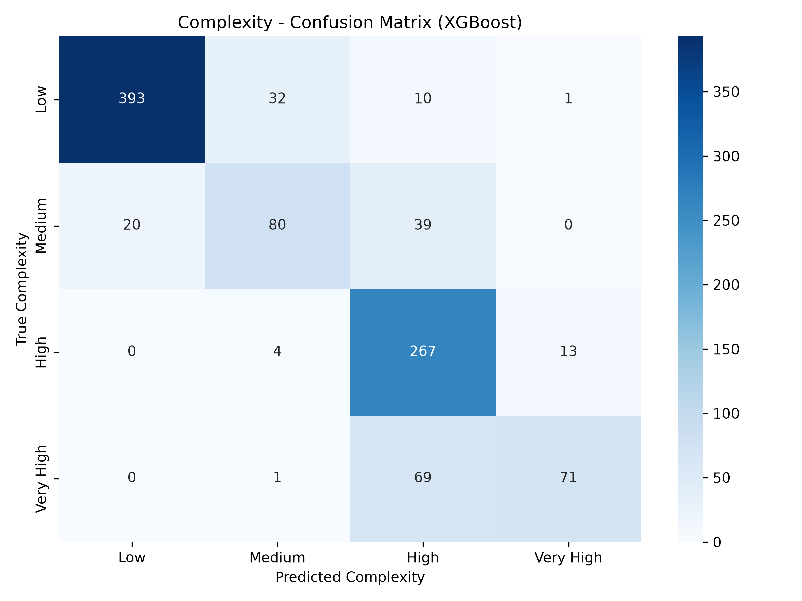

# Confusion Matrix Evaluation Report
**Model:** XGBoost Regressor (Mapped to Complexity Categories)

## 1. Overview
This confusion matrix evaluates the performance of the Smart Agile Task Manager AI. Because the core AI model uses Regression (predicting exact, continuous decimal values for Time and Effort), a traditional classification confusion matrix cannot be applied directly to the raw output. 

To overcome this and evaluate categorical accuracy, this matrix was generated by evaluating the final "snapped" **Complexity Categories** (Low, Medium, High, Very High) generated by the system.

## 2. How It Was Generated
The industry-standard approach was used to generate this matrix:
1. **The Dataset (Truth):** 1,000 real tasks were isolated into a testing dataset. The true complexity of these tasks is known.
2. **The Model (Prediction):** The trained XGBoost model was given the text descriptions of these 1,000 tasks and asked to predict the complexity, having never seen the answers.
3. **The Matrix:** The `scikit-learn` library mathematically compared the Model's predictions against the Dataset's absolute truth to populate the matrix.

## 3. Complexity Categories Explained
In Agile development, effort is estimated using Story Points (Fibonacci sequence: 1, 2, 3, 5, 8, 13, 21). The AI maps these numerical points into four distinct categories for easier human readability:

* **Low (1-3 Points):** Fast, easy tasks (e.g., fixing typos, changing a button color).
* **Medium (5 Points):** Standard, average effort tasks (e.g., adding a simple form).
* **High (8-13 Points):** Difficult, time-consuming tasks (e.g., building a login system).
* **Very High (21 Points):** Massive, highly complicated architecture tasks.

## 4. How to Read the Matrix
* **Y-Axis (True Complexity):** The actual, real-world complexity of the task.
* **X-Axis (Predicted Complexity):** What the AI guessed the complexity was.

### The Diagonal (Correct Predictions)
The dark blue boxes going diagonally from the top-left to the bottom-right represent perfect predictions where the AI matched reality:
* **393:** Correctly predicted as Low complexity.
* **80:** Correctly predicted as Medium complexity.
* **267:** Correctly predicted as High complexity.
* **71:** Correctly predicted as Very High complexity.

### The Off-Diagonal (Mistakes)
Boxes outside the main diagonal represent prediction errors. For example, in the **Medium row**, the AI correctly guessed 80 tasks, but it underestimated 20 tasks (guessing they were Low) and overestimated 39 tasks (guessing they were High). 

## 5. Conclusion
The strong, dark diagonal line demonstrates that the XGBoost model is highly accurate at identifying the correct complexity tier for Agile tasks. 

Furthermore, when the AI does make an error (the off-diagonal numbers), it is almost exclusively off by only a single adjacent tier. The matrix proves that the AI almost never makes catastrophic errors (such as mistaking a 'Low' complexity task for a 'Very High' complexity task), making it a reliable tool for Agile estimation.
